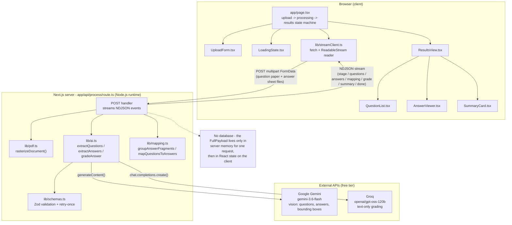
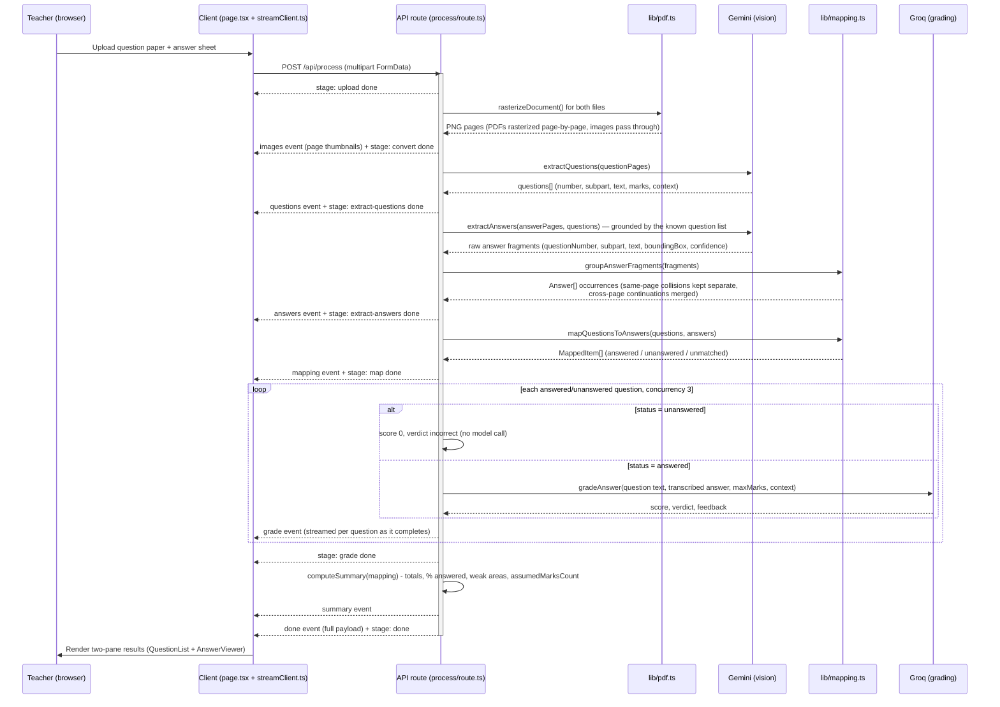

# AI Assessment Extraction & Answer Mapping

A teacher uploads a question paper and one student's handwritten answer sheet. The app extracts every question, transcribes and locates every answer on the sheet, maps answers to questions, and lets the teacher click a question to see exactly where — pixel-for-pixel — the student answered it. It also grades each answer with AI feedback and shows an overall summary.

Built for the VedaAI hiring assignment.

## Tech stack

- **Next.js 14** (App Router) + TypeScript + Tailwind CSS
- **Gemini** (`gemini-3.6-flash`, free tier) for vision extraction — reading question paper pages and handwritten answer sheet pages, transcribing text, and producing bounding boxes
- **Groq** (`openai/gpt-oss-120b`, free tier) for grading — text-only scoring + feedback per answer
- `pdf-to-img` (pdfjs-dist under the hood) to rasterize PDF pages to PNGs server-side, since vision models take images, not PDFs
- Zod to validate every LLM JSON response, with a retry-once-with-a-stricter-prompt fallback
- No database — everything lives in server memory for the duration of one request and is streamed to the client, which holds it in React state

## Why two providers

The spec allows any model with a free tier. Groq is excellent for fast, cheap text inference, but at the time of building this its hosted model catalog (checked live via `GET /openai/v1/models`) had no vision-capable chat model — no way to feed it an image. Since reading the question paper and the handwritten answer sheet (including localizing bounding boxes) is the actual core of this assignment, that step needs a model that can see. Gemini's free tier does, and its `gemini-3.6-flash` model is fast enough for this. Grading is a text-only task (question text + transcribed answer → score/verdict/feedback), so it runs on Groq instead, split cleanly through `lib/ai.ts` so either provider can be swapped independently.

## Bring your own API key

The deployed site ships with the owner's own `GEMINI_API_KEY` / `GROQ_API_KEY` as a shared fallback, so anyone can try it with zero setup — but free-tier quotas are shared across every visitor using that fallback (this is exactly what happened during development: the free Gemini tier's 20-request window got exhausted repeatedly from iterative testing). To avoid one visitor's testing starving everyone else's:

- On first visit, `components/ApiKeyModal.tsx` asks the visitor to choose **"Use the free demo keys"** (the owner's, shared) or **"Use my own API keys"** (their own Gemini/Groq keys, entered in the modal).
- The choice — and any keys typed in — are saved only in that browser's `localStorage` (`lib/apiKeyStorage.ts`), never sent anywhere except back to this app's own `/api/process` endpoint, and never written to a database or log. A key icon next to the profile avatar in the top bar reopens the modal to change the choice later.
- When "own keys" is selected, `lib/streamClient.ts` appends `geminiApiKey` / `groqApiKey` as extra fields on the same multipart `FormData` request that already carries the files. The API route reads them (`app/api/process/route.ts`) into an `ApiKeyOverrides` object and threads it through `extractQuestions` / `extractAnswers` / `gradeAnswer` (`lib/ai.ts`), each of which prefers the per-request key and only falls back to `process.env.GEMINI_API_KEY` / `GROQ_API_KEY` when it's absent. Leaving one of the two fields blank while "own keys" is selected just falls that one service back to the shared key — they're independent.
- This was verified against the real APIs, not just typechecked: a deliberately invalid key sent through the form produced Google's own `400 API_KEY_INVALID` error, confirming the override actually reaches the `generateContent()` call rather than being silently ignored.

## Architecture



There's no server the client talks to besides this one route, and no data store anywhere — every box above except the two external AI APIs lives inside this single Next.js project, and `NoDB` is the actual state of the world, not a caveat.

## Setup

```bash
npm install
cp .env.example .env.local
# Fill in GEMINI_API_KEY (https://aistudio.google.com/apikey)
# and GROQ_API_KEY (https://console.groq.com/keys)
npm run dev
```

Open http://localhost:3000.

## Approach

**Pipeline** (`app/api/process/route.ts`), streamed to the client as newline-delimited JSON events so the progress stepper reflects real backend state, not a fake spinner. This is the actual sequence the single `POST` handler executes, top to bottom, in one request:



Note `unmatched` answers (fragments that never matched a question) are never sent to Groq — grading only runs over `mapping` items with a real `question`.

1. **Upload** — both documents arrive as `FormData` (PDF and/or image files, multiple allowed per side).
2. **Convert** — every file is rasterized to PNG pages (`lib/pdf.ts`). Images pass through unchanged; PDFs are rendered page-by-page via `pdf-to-img`. Pages are numbered continuously if a document is uploaded as multiple files.
3. **Extract questions** — all question paper pages are sent to Gemini in one call, each labeled `Page N`, with a prompt that asks for every question **in printed order**, splitting labelled sub-parts (`11(a)`, `11(b)`) into separate entries that share a number but carry distinct subparts (`lib/ai.ts:extractQuestions`). Reading-comprehension questions also get a `context` field capturing the actual passage/story text they're based on, so grading (step 6) can check answers against the real source instead of guessing.
4. **Extract answers** — likewise, all answer sheet pages go to Gemini in one call, but this call also receives the exact list of question numbers/subparts already extracted in step 3 as grounding context, so the model can check candidate matches against real questions instead of guessing from handwriting structure alone (this is what correctly distinguishes a numbered *list* answering one question — e.g. "give meanings of these 5 words" — from several genuinely separate questions that happen to share section-local numbers, like three True/False items numbered 1, 2, 3). For each distinct answer found, the model returns the question number/subpart it believes it's answering, a transcription, a confidence score, and a bounding box in a **normalized 0–1000 coordinate space** (`lib/ai.ts:extractAnswers`). If the same question continues on a later page, the model emits a separate fragment for that page rather than trying to merge across pages itself — merging is done deterministically afterward.
5. **Map** — fragments are grouped by normalized `(number, subpart)` key into `Answer` occurrences (`lib/mapping.ts`). Multi-section papers commonly restart numbering per section (a True/False Q1, a comprehension Q1, and a "who said this" Q1 can all legitimately share the bare number "1"), so fragments sharing a key are only merged into one multi-region `Answer` when they're on *different* pages (a genuine continuation); fragments sharing a key on the *same* page are kept as separate `Answer` occurrences instead of being concatenated into one polluted answer. Questions are then matched against those occurrences in printed order, consuming one occurrence per matching question:
   - a match → `answered`
   - no match → `unanswered`
   - any answer occurrence left over after all questions are matched → appended as `unmatched`
6. **Grade** — grading against a question's `context` (when present) verifies facts against that real passage rather than Groq's own guess; when no passage was captured but the question still looks passage-dependent, the prompt explicitly tells the model not to invent a specific "expected answer" from outside knowledge, and to grade leniently on coherence/relevance instead (`lib/ai.ts:gradeAnswer`). Each answered/unanswered question is graded (unanswered questions get an automatic 0 with no model call; answered ones are sent to Groq with a small concurrency cap to stay within free-tier rate limits). Results stream back per-question so the UI fills in scores as they arrive, and a final summary (total score, % answered, weak areas) is computed once grading finishes. Each `Grading` also carries a `marksSource: "paper" | "assumed"` (`app/api/process/route.ts`) recording whether `maxMarks` came from a value actually printed on the paper or from the 10-mark fallback — see the "Marks default to 10" point under Assumptions & limitations below for how the UI surfaces this.

**Bounding boxes** are the part most likely to be imperfect (see Limitations), so the UI is built to degrade gracefully: boxes render as absolutely-positioned, percentage-based `<div>` overlays on top of the answer sheet `` (so they stay correctly placed at any render size), and any answer with a missing or low-confidence box still shows its transcribed text with an "AI unsure" badge instead of a highlight.

**Client state** (`app/page.tsx`) is a simple three-phase state machine (`upload → processing → results`) fed by the NDJSON stream (`lib/streamClient.ts`); nothing is persisted server-side between requests, matching the "no DB, ephemeral serverless" constraint.

## Edge cases handled

| Case | Behavior |
|---|---|
| Unanswered question | Shown in the list with a "Not answered" badge; right pane shows an explicit "No answer detected" state instead of a highlight |
| Out-of-order answers | Mapping matches by `(number, subpart)`, not by page/position, so order on the answer sheet doesn't matter |
| Answer with no matching question | Surfaced in a separate "Unmatched answers" section at the bottom of the list, still clickable and highlighted |
| Multi-page answers | Fragments sharing a question number are grouped into one `Answer` with multiple `regions`; the viewer shows a labeled page-picker pill row plus an inline "continued on p.N →" / "← continued from p.N" chip directly on the highlighted box, both clickable to jump straight to the continuation |
| Sub-part numbering | `11(a)`/`11(b)` are extracted and mapped as distinct entries; sub-part rows carry a letter badge (`a`, `b`) instead of a number so they read as part of the same question |
| Multiple answers on one page/region | The extraction prompt asks for separate bounding boxes per answer even when they share a page; each is its own entry |
| Low-confidence transcription | Every answer carries a 0–1 confidence score; below 0.55 it's flagged with an "AI unsure" badge in both the list and the highlight panel |
| Missing/unlocalizable bounding box | Falls back to text-only display with a note, rather than drawing a wrong box or crashing |
| Malformed LLM JSON | Every model call is Zod-validated; on failure it retries once with a stricter prompt before surfacing an error |

## Assumptions & limitations

- **Bounding-box accuracy is the weakest link.** Vision LLMs (Gemini included) are not pixel-precise object detectors; boxes can be loose, slightly offset, or occasionally missing, especially on dense or messy handwriting. This is disclosed intentionally rather than hidden — the UI treats a missing/low-confidence box as an expected state, not an error.
- **One student, one attempt.** The flow assumes exactly one answer sheet per run, per the assignment scope.
- **Question numbering must be inferable.** Matching relies on the student writing (or Gemini being able to infer) a recognizable question number; a completely unlabeled answer with no positional clue will land in "Unmatched answers" or be missed.
- **Marks default to 10** when a question paper doesn't print marks per question, so grading always has a denominator — but this is never presented as if it came from the paper. Every `Grading` carries a `marksSource: "paper" | "assumed"` (set in `app/api/process/route.ts`: `"paper"` when `question.marks` was actually extracted, `"assumed"` when it was `null` and the fallback kicked in). The UI surfaces this rather than hiding it: assumed-mark score pills get a `*` with a tooltip, the expanded question detail shows an explicit "Assumed out of 10 — not printed on the question paper" badge, and the summary card's total score gets a footnote naming how many questions contributed an assumed denominator.
- **No persistence.** Refreshing the results page loses the run — there's no DB by design; re-upload to reprocess.
- **Free-tier rate limits.** Grading runs with a concurrency cap of 3 to stay under Groq's free-tier RPM; very long papers will take longer than a quick demo paper. Gemini's free tier is also capped (observed: 20 requests per model per window on `gemini-3.6-flash`) — since each run makes 2 Gemini calls (questions + answers), heavy iterative testing can hit a `429` mid-run; the error surfaces as a normal pipeline error with Google's retry-after message rather than a crash.
- **Serverless request size/time.** Vercel's Hobby plan caps request bodies (~4.5 MB) and function duration; very large scanned PDFs may need a smaller/rescanned file or a paid plan with `vercel.json`'s `maxDuration` raised further.
- **UI matches exported Figma screens**, not a live Figma connection. The design file itself needs a logged-in session that automated fetching can't reach; the teacher (empty/filled) exported screenshots for the upload, loading, and question/answer-mapping screens (desktop + mobile), which this UI was built to match directly — dark icon sidebar, orange/coral accent system, letter-badge sub-parts, and the green highlight-with-tag on the answer sheet. The one deviation is the loading screen's teacher illustration, which is a stylized placeholder (an emoji avatar in a decorated circle) since the original artwork asset wasn't extractable from a screenshot.
- **`pdf-to-img`'s pdfjs-dist dependency has an open advisory** for arbitrary JS execution when opening a maliciously crafted PDF (`GHSA-hq66-cqwq-w95j`). Since this app rasterizes user-uploaded PDFs server-side, that's a real consideration for a production deployment — fixing it means a breaking downgrade of `pdf-to-img`, out of scope for this assignment, but worth flagging rather than silently shipping.

## Deploying to Vercel

```bash
vercel
```

Set `GEMINI_API_KEY` and `GROQ_API_KEY` (and optionally `GEMINI_MODEL` / `GROQ_MODEL`) as environment variables in the Vercel project settings. `vercel.json` extends the API route's max duration to 60s for longer documents. No other server state assumptions exist — every request is self-contained.
